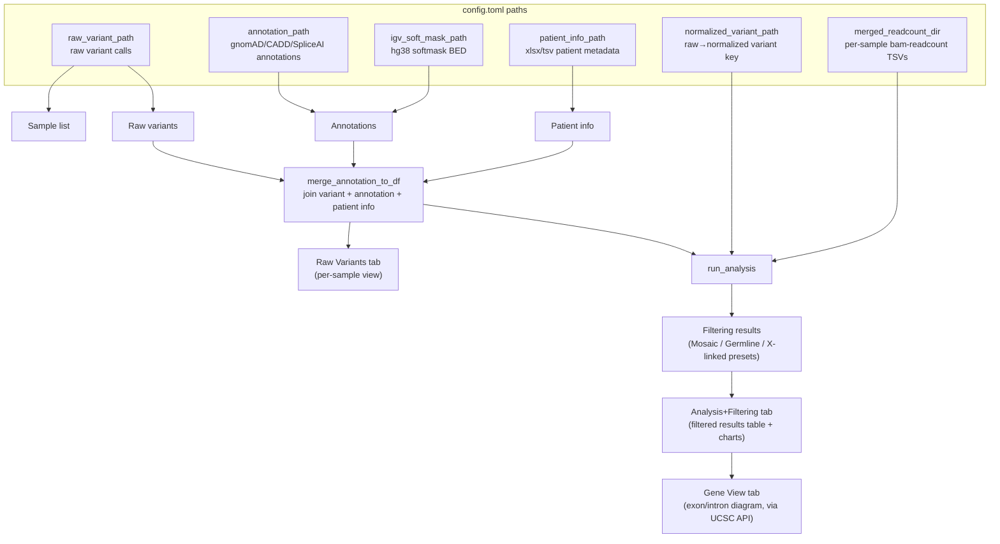

# MoVE - Mosaic Variant Explorer

This application is used to explore mosaic variants found in genomic data.

Released under the [MIT License](LICENSE) -- provided as-is, with no
guaranteed support.

## Quickstart

Both options below run against the bundled [test_data/](test_data) -- a
100-sample dummy dataset (generated by
[test_data/generate.py](test_data/generate.py)) with its own
[test_data/config.toml](test_data/config.toml) already pointing at the
bundled TSVs/Excel file, so no real config, storage mounts, or reverse proxy
needed.

**Option A: pip**

```bash
pip install -r requirements.txt
MOVE_CONFIG_PATH=test_data/config.toml streamlit run app.py -- --debug
```

Drop `-- --debug` if you don't want debug-level logging (app.py logs to
stderr; add it after a literal `--` since that's how Streamlit passes
arguments through to the script). Then open http://localhost:8501.

**Option B: Docker**

```bash
docker build --platform linux/amd64 -t move .
docker run --rm -it \
    --platform linux/amd64 \
    -p 8501:8501 \
    -v "$(pwd)":/move/app \
    -w /move/app \
    -e MOVE_CONFIG_PATH=test_data/config.toml \
    -e STREAMLIT_BROWSER_GATHER_USAGE_STATS=false \
    move \
    /opt/miniconda3/envs/MoVE/bin/streamlit run app.py \
        --server.port=8501 --server.address=0.0.0.0 -- --debug
```

Then open http://localhost:8501. See [Build the Docker image](#build-the-docker-image)
below for details on the image itself.

Either way: load all 100 samples and filter away. The "IGV" links in the
results table won't resolve to real reads since `test_data/` has no CRAM
files, but filtering, plots, and the per-variant view all work against the
dummy calls. Neither option uses `move_proxy` (TLS/Basic Auth reverse proxy)
-- that's only needed for the shared WashU compute1 deployment, see
[Running on compute1](#running-on-compute1-washu-internal) below.

## How data flows through the app



## Configuration

Data paths (readcount/variant/annotation TSVs, patient info spreadsheet) are
read from `config.toml`, not hardcoded in `app.py`. Copy
[config.example.toml](config.example.toml) to `config.toml` in the working
directory and fill in real paths for your environment (or point the
`MOVE_CONFIG_PATH` env var at a config file elsewhere, as the Quickstart
above does for `test_data/config.toml`). `app.py` validates every path
exists at startup and shows a clear error instead of running if one is
missing.

The "Gene View" tab fetches hg38 exon/intron coordinates live from UCSC's
public REST API (`api.genome.ucsc.edu`), so wherever `app.py` runs needs
outbound network access to that host. It degrades gracefully (a warning in
the tab, not a crash) if UCSC is unreachable -- everything else in the app
works offline.

## Build the Docker image

```bash
docker build --platform linux/amd64 -t apaul7/docker-move:1.0.1 .
```

`--platform linux/amd64` targets the LSF compute nodes below, so build on Apple
Silicon (or any non-amd64 host) needs it too or the image won't run there.
Bump the version tag (`1.0.0` -> `1.0.1`, etc.) on rebuilds so `bsub` below
picks up the new image intentionally rather than reusing a stale tag. Each
build also generates a fresh self-signed TLS cert baked into the image (see
[go/main.go](go/main.go)), so `bsub` picking up a new tag also means a new
cert that browsers will need to re-trust.

Push the tag so the LSF compute node (below) can pull it:

```bash
docker push apaul7/docker-move:1.0.1
```

## Running on compute1 (WashU-internal)

This section is specific to the shared LSF deployment at WashU and uses
`move_proxy` (TLS + Basic Auth reverse proxy) -- skip it entirely for local
or personal use, see [Quickstart](#quickstart) above instead.

```bash
# make run.sh
echo """
# launch streamlit
# CORS/XSRF protection is left at Streamlit's secure defaults (both enabled).
# move_proxy passes the original Host header through unchanged so it matches
# the browser's Origin header -- required for Streamlit's WebSocket
# (/_stcore/stream) handshake to pass its check_origin check.
export STREAMLIT_BROWSER_GATHER_USAGE_STATS=false
# add "-- --debug" after the streamlit args below for debug-level logging
/opt/miniconda3/envs/MoVE/bin/streamlit run app.py --server.port=8503 --server.address=0.0.0.0 &
# launch reverse proxy (built into the image at /usr/local/bin/move_proxy, on PATH)
# MOVE_USERNAME/MOVE_PASSWORD are required Basic Auth credentials for the proxy.
# Set real values here before running -- do not commit actual credentials to git.
export MOVE_USERNAME=<username>
export MOVE_PASSWORD=<password>
# add -debug below for debug-level logging (request headers, auth/lockout detail)
move_proxy -mapping sample_cram_paths.tsv -listen :8501 -streamlit http://127.0.0.1:8503 -html igv_viewer.html
""" > run.sh
chmod +x run.sh

LSF_DOCKER_VOLUMES="/path/to/data/:/path/to/data/:ro /path/to/reference/:/path/to/reference/:ro" \
LSF_DOCKER_PORTS='8590:8501' \
bsub -q general \
    -R "select[mem>50GB] rusage[mem=50GB]" \
    -G <compute-group> \
    -K \
    -J run_move \
    -R 'select[port8590=1]' \
    -a 'docker(apaul7/docker-move:1.0.1)' \
    ./run.sh

# example url for igv.js (TLS cert is self-signed, browser will warn on first visit):
https://<compute-node>.ris.wustl.edu:8590/igvjs/?sample=SAMPLE1&chromosome=chr3&position=23203128
```

## Run tests

CI ([.github/workflows/tests.yml](.github/workflows/tests.yml)) runs pytest
automatically on every push to `main` and on every pull request opened
against `main`.

Locally (matches the Quickstart pip path above):

```bash
pip install -r requirements.txt
pytest
```

Or in Docker, against the same conda env used to run the app (no local
Python setup needed):

```bash
docker run --rm \
    --platform linux/amd64 \
    -v "$(pwd)":/move/app \
    -w /move/app \
    apaul7/docker-move:1.0.1 \
    /opt/miniconda3/envs/MoVE/bin/pytest
```

## AI assistance

AI (Anthropic's Claude) was used to help develop and test this project.
